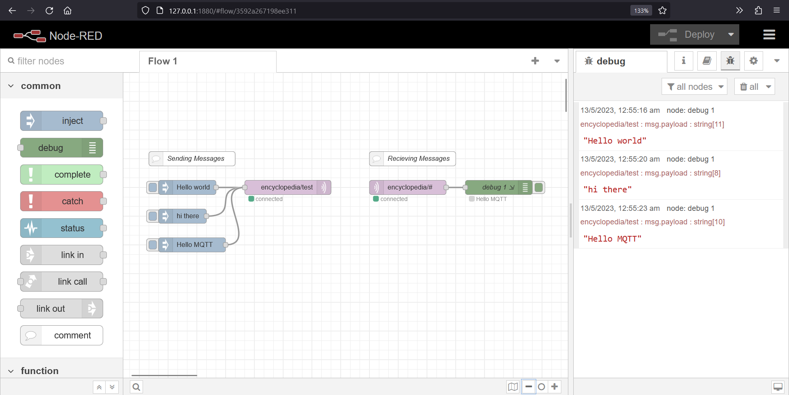

# Node Red MQTT Demo 

## Steps

1. Make sure you have Node Red installed. if not, install using `npm install -g --unsafe-perm node-red`
2. Run `node-red` in cmd
3. Open the given server address. It is http://127.0.0.1:1880/ in my case.
4. Import the flows.json file 
5. Deploy it

Note- Rename `flows-example.json` to `flows.json`. also fill in the `"broker"` and `"port"`. I have used HiveMQ in my case.